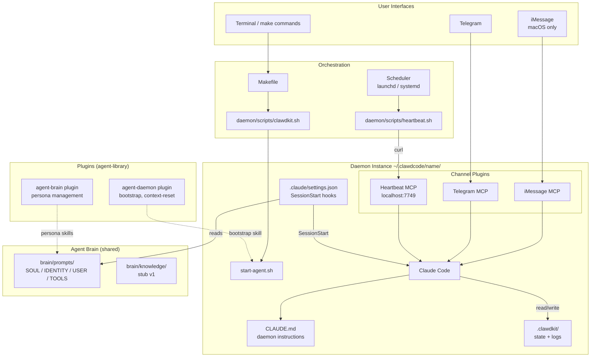
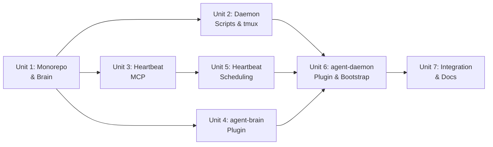

# feat: ClawdKit — Persistent Claude Code Agent

## Overview

ClawdKit is a toolkit for running persistent, autonomous Claude Code agents. It has two logically separate components in one monorepo:

1. **Daemon** — tmux-hosted persistent session with heartbeat scheduling, channel MCP servers, and an `agent-daemon` plugin managing daemon-specific skills (bootstrap, context reset, etc.)
2. **Agent Brain** — persistent persona (SOUL, IDENTITY, USER, TOOLS) and knowledge framework that works across both daemon instances and interactive sessions, packaged as an `agent-brain` plugin (replacing the existing `~/agent_brain` project)

Each daemon instance lives at `~/.clawdcode/<agent_name>/` and is initialized via a guided bootstrap skill. The daemon's SessionStart hooks read persona files from the brain. Both components are published as plugins to the `agent-library` marketplace.

## Problem Frame

Claude Code sessions are ephemeral — they lose context when closed and don't proactively act when idle. ClawdKit adds persistence, proactive behavior, and messaging channels while staying native to Claude Code's tooling. The agent brain provides consistent identity across all session types. (see origin: docs/brainstorms/2026-03-24-clawdkit-requirements.md)

## Requirements Trace

- R1. Prompt file architecture — SOUL.md, IDENTITY.md, USER.md, TOOLS.md as standalone files in the brain, injected into daemon sessions via SessionStart hooks. HEARTBEAT.md read on-demand.
- R2. HEARTBEAT.md — Configurable checklist of proactive tasks run every 30 minutes
- R3. Heartbeat scheduling — System scheduler (launchd/systemd) fires every 30 min, heartbeat.sh POSTs to a colocated heartbeat MCP server
- R4. Messaging channels — Telegram (cross-platform) and iMessage (macOS only) configured at launch
- R5. tmux session management — Named session per daemon instance, scripts + Makefile for lifecycle
- R6. Context window management — /compact and /clear via tmux send-keys, managed by the agent-daemon plugin. Persona re-injected mechanically by hooks on new sessions.
- R7. Hybrid assistant role — Dev + personal assistant, behaviors defined in brain + HEARTBEAT.md
- R8. Bootstrap sequence — SessionStart hooks inject persona from brain. CLAUDE.md provides daemon instructions. State.json provides continuity.
- R9. Plugin architecture — `agent-daemon` and `agent-brain` plugins in agent-library marketplace. Daemon plugin includes bootstrap skill with guided onboarding.
- R10. Agent Brain — Persistent persona files + knowledge/memory framework (stub for v1). Replaces existing `~/agent_brain` project and `agent-brain@agent-library` plugin.

## Scope Boundaries

- Unix-compatible: macOS primary, Linux supported
- No Discord at launch (deferred)
- No custom UI — channels and terminal only
- No database — file-based state
- Knowledge/memory framework is a stub in v1 — directory structure only, implementation deferred
- Plugin installation (iMessage, Telegram) is a manual prerequisite
- iMessage is macOS-only

## Context & Research

### Relevant Code and Patterns

- **fakechat plugin**: Channel plugin pattern — Bun/TS MCP server with stdio + HTTP listener. Heartbeat MCP forks this.
- **Existing agent-brain** (`~/agent_brain`): Fully scaffolded PARA-adapted vault with identity, memory, and templates. Plugin at `agent-brain@agent-library` v1.0.0. Will be replaced by the brain submodule.
- **Claude Code SessionStart hooks**: `hookSpecificOutput.additionalContext` injects content into system prompt. Configured in `.claude/settings.json` at project level.
- **Claude Code plugin structure**: `.claude-plugin/plugin.json` declares name, version, agents, skills. Published to marketplaces via git.
- **Channel notification contract**: `notifications/claude/channel` with `content` and `meta` fields.

### Institutional Learnings

- **Over-engineering anti-pattern**: Apply "Do I Need This Today?" test. Brain memory framework is deliberately stubbed.
- **AI Developer Pipeline alignment**: Daemon = Session Runner, heartbeat = Persistent Agent Host. Unix compatibility supports container migration.
- **macOS CLI gotchas**: POSIX-compatible commands in all scripts.

### External References

- **launchd** (macOS): Sleep/wake resilient. `launchctl bootstrap/bootout`.
- **systemd timers** (Linux): `OnCalendar=*:0/30`, `Persistent=true`.
- **Claude Code hooks**: SessionStart, `additionalContext` injection.
- **Claude Code channels**: Research preview, March 2026. MCP over stdio.

## Key Technical Decisions

- **Monorepo with logical submodules**: `daemon/` and `brain/` are separate directories that can be split into independent repos later. Shared `docs/` and `plugins/` at root. Simplicity now, separability later.
- **SessionStart hooks for persona injection**: Each persona file gets a hook that reads from `brain/prompts/` and injects via `additionalContext`. Mechanical — not dependent on LLM behavior. Re-fires on every new session including after /clear.
- **Colocated MCP server**: Heartbeat MCP lives at `daemon/mcp/heartbeat/` within the project. Loaded via development channel flag or packaged in the daemon plugin.
- **Bootstrap skill creates daemon instances**: `~/.clawdcode/<agent_name>/` is the runtime directory for each daemon. The bootstrap skill in the agent-daemon plugin scaffolds this directory with `.claude/settings.json` (hooks pointing back to brain), `CLAUDE.md` (daemon instructions), `.clawdkit/` (state files), and scheduler config. Guided onboarding seeds initial configuration.
- **Two plugins in agent-library**: `agent-daemon` (daemon lifecycle skills) and `agent-brain` (persona management, knowledge ingestion). Both published to `github.com/jvall0228/agent-library`.
- **agent-daemon plugin manages tmux send-keys**: The plugin includes skills for triggering /clear and /compact on the daemon's own tmux session, since the agent can't invoke these slash commands directly through channels.
- **Platform-adaptive scheduling**: launchd on macOS, systemd on Linux. POSIX sh scripts throughout.
- **Telegram as default notification channel**: Cross-platform, less intrusive, richer tools.
- **Brain replaces existing agent-brain**: The existing `~/agent_brain` repo and plugin are superseded. Useful scaffolding (templates, identity structure) is carried forward.

## Open Questions

### Resolved During Planning

- **Separate vs same project**: Same project with logical submodules. Can split later.
- **Prompt file loading**: SessionStart hooks with `additionalContext`.
- **Scheduler**: launchd (macOS) + systemd (Linux).
- **Heartbeat delivery**: Custom channel MCP, colocated in daemon.
- **Existing agent-brain**: Replaced by brain submodule. Useful structure carried forward.

### Deferred to Implementation

- **Multiple --channels flag syntax**: Verify at runtime.
- **/clear behavior with channels**: Warm vs cold restart. Test early.
- **Development channel loading vs marketplace packaging**: For the heartbeat MCP.
- **Hook output size limits**: Monitor persona file sizes (50K char threshold).
- **Knowledge/memory framework design**: Stubbed in v1. Directory structure only.
- **Daemon plugin skill for /compact**: Exact mechanism for the agent to trigger /compact on its own session via tmux send-keys.

## High-Level Technical Design

> *Directional guidance for review, not implementation specification.*

### Project Structure

```
clawdkit/
├── daemon/
│   ├── mcp/
│   │   └── heartbeat/          # Colocated heartbeat MCP server
│   │       ├── server.ts
│   │       ├── package.json
│   │       └── .mcp.json
│   ├── scripts/
│   │   ├── clawdkit.sh         # Lifecycle management
│   │   ├── start-agent.sh      # tmux wrapper with restart
│   │   ├── heartbeat.sh        # Scheduler-triggered heartbeat
│   │   └── hooks/
│   │       ├── inject-soul.sh
│   │       ├── inject-identity.sh
│   │       ├── inject-user.sh
│   │       └── inject-tools.sh
│   ├── config/
│   │   ├── com.clawdkit.heartbeat.plist   # macOS
│   │   ├── clawdkit-heartbeat.service     # Linux
│   │   └── clawdkit-heartbeat.timer       # Linux
│   └── templates/
│       ├── CLAUDE.md.template    # Daemon-specific instructions
│       └── settings.json.template # Hooks config for daemon instance
├── brain/
│   ├── prompts/
│   │   ├── SOUL.md
│   │   ├── IDENTITY.md
│   │   ├── USER.md
│   │   └── TOOLS.md
│   ├── knowledge/               # Stub — directory structure only
│   │   └── README.md
│   └── CONTEXT.md
├── plugins/
│   ├── agent-daemon/
│   │   ├── .claude-plugin/plugin.json
│   │   └── skills/
│   │       ├── bootstrap/       # Init daemon at ~/.clawdcode/<name>
│   │       ├── context-reset/   # /clear via tmux send-keys
│   │       └── context-compact/ # /compact via tmux send-keys
│   └── agent-brain/
│       ├── .claude-plugin/plugin.json
│       └── skills/
│           └── ... (persona management, carried from existing)
├── docs/
│   ├── brainstorms/
│   ├── plans/
│   └── SETUP.md
├── Makefile
└── .gitignore
```

### Daemon Instance (created by bootstrap)

```
~/.clawdcode/<agent_name>/
├── .claude/
│   └── settings.json     # SessionStart hooks pointing to brain/prompts/
├── CLAUDE.md              # Daemon-specific instructions (from template)
├── .clawdkit/
│   ├── state.json
│   ├── progress.log
│   └── heartbeat.lock
└── prompts/
    └── HEARTBEAT.md       # Instance-specific heartbeat config
```

### Component Architecture



## Implementation Units



---

- [ ] **Unit 1: Monorepo Structure & Agent Brain**

**Goal:** Scaffold the monorepo with daemon/ and brain/ submodules. Migrate useful structure from existing agent-brain. Create persona file placeholders and knowledge stub.

**Requirements:** R1, R10

**Dependencies:** None

**Files:**
- Create: `.gitignore`
- Create: `brain/prompts/SOUL.md`
- Create: `brain/prompts/IDENTITY.md`
- Create: `brain/prompts/USER.md`
- Create: `brain/prompts/TOOLS.md`
- Create: `brain/knowledge/README.md`
- Create: `brain/CONTEXT.md`
- Create: `daemon/` directory structure (empty, populated in later units)

**Approach:**
- Initialize git
- Carry forward useful structure from existing `~/agent_brain`: identity file layout, template patterns, CONTEXT.md bootstrap concept
- Persona files in `brain/prompts/` with YAML frontmatter. Placeholder content with clear sections for user customization
- `brain/knowledge/` is a stub — README describing the planned framework, empty directories for future implementation
- `brain/CONTEXT.md` describes the brain's purpose, structure, and how agents should use it
- Keep persona files under 2,500 tokens each (10K total budget)

**Patterns to follow:**
- Existing `~/agent_brain` identity structure (purpose, capabilities, boundaries, voice)
- Shared brain YAML frontmatter conventions

**Test scenarios:**
- Happy path: Brain files exist with valid frontmatter and placeholder content
- Edge case: Total persona content within token budget
- Happy path: `brain/knowledge/` stub exists with README explaining future plans

**Verification:**
- All persona files and knowledge stub exist
- Structure mirrors useful parts of existing agent-brain
- CONTEXT.md clearly explains the brain's purpose

---

- [ ] **Unit 2: Daemon Scripts & tmux Management**

**Goal:** POSIX-compatible lifecycle scripts and Makefile for daemon instances.

**Requirements:** R5, R6

**Dependencies:** Unit 1

**Files:**
- Create: `daemon/scripts/clawdkit.sh`
- Create: `daemon/scripts/start-agent.sh`
- Create: `daemon/scripts/hooks/inject-soul.sh`
- Create: `daemon/scripts/hooks/inject-identity.sh`
- Create: `daemon/scripts/hooks/inject-user.sh`
- Create: `daemon/scripts/hooks/inject-tools.sh`
- Create: `daemon/templates/CLAUDE.md.template`
- Create: `daemon/templates/settings.json.template`
- Create: `Makefile`

**Approach:**
- All scripts POSIX sh. OS detection via `uname -s`.
- Hook scripts read persona files from brain and output JSON with `additionalContext`. The path to brain/prompts/ is configured in the daemon instance's settings.json (set during bootstrap).
- `CLAUDE.md.template` contains daemon instructions: state.json reconstruction, heartbeat processing, notification channel. Stamped with instance-specific values during bootstrap.
- `settings.json.template` configures 4 SessionStart hooks pointing to the hook scripts with the brain path as an argument.
- `clawdkit.sh` subcommands: start, stop, restart, status, health, install, uninstall. Takes `--instance <name>` flag to target a specific daemon at `~/.clawdcode/<name>/`.
- `start-agent.sh` runs inside tmux: launches Claude Code with channel flags from the daemon instance directory. 3 retries with 5s delay on crash.
- tmux session named `clawdkit-<agent_name>`. `remain-on-exit on`.
- iMessage channel flag included only on macOS.
- Makefile dispatches to clawdkit.sh with instance name.

**Patterns to follow:**
- SessionStart hook JSON format: `{"hookSpecificOutput": {"hookEventName": "SessionStart", "additionalContext": "..."}}`
- `tmux has-session` / `display-message` for health

**Test scenarios:**
- Happy path: Hook scripts read persona files, output valid JSON with additionalContext
- Happy path: `make start` creates tmux session, Claude Code receives persona via hooks
- Edge case: Brain path doesn't exist — hook outputs empty additionalContext, logs warning
- Edge case: Running on Linux — iMessage flag omitted
- Error path: Claude Code crashes — 3 retries with 5s delay
- Integration: Full bootstrap -> start -> hooks fire -> persona injected -> agent operational

**Verification:**
- Hook scripts produce valid JSON when run standalone
- tmux session starts and Claude Code receives all 4 persona files
- Works on both macOS and Linux

---

- [ ] **Unit 3: Heartbeat MCP Server**

**Goal:** Bun/TypeScript channel MCP colocated in the daemon, receives HTTP POST and pushes heartbeat notifications.

**Requirements:** R2, R3

**Dependencies:** Unit 1

**Files:**
- Create: `daemon/mcp/heartbeat/server.ts`
- Create: `daemon/mcp/heartbeat/package.json`
- Create: `daemon/mcp/heartbeat/.mcp.json`

**Approach:**
- Fork fakechat pattern: stdio MCP + HTTP listener in one Bun process
- Declares `experimental: { 'claude/channel': {} }` capability
- HTTP on port 7749, bound to `127.0.0.1`
- POST body = heartbeat prompt, wrapped as `notifications/claude/channel` with `source: "heartbeat"`
- Minimal: no auth, no reply tool, one-way push
- Colocated in daemon/ — loaded via development channel flag or through the daemon plugin

**Patterns to follow:**
- fakechat: `@modelcontextprotocol/sdk`, `StdioServerTransport`

**Test scenarios:**
- Happy path: curl POST produces channel notification in Claude Code session
- Edge case: Empty POST — 400, no notification
- Edge case: Port in use — visible error
- Error path: stdio closed — clean exit
- Integration: heartbeat.sh -> HTTP -> MCP -> Claude processes heartbeat

**Verification:**
- Plugin loads with Claude Code
- curl POST to localhost:7749 produces visible channel event

---

- [ ] **Unit 4: agent-brain Plugin**

**Goal:** Package the brain as an `agent-brain` plugin for the agent-library marketplace, replacing the existing plugin.

**Requirements:** R10

**Dependencies:** Unit 1

**Files:**
- Create: `plugins/agent-brain/.claude-plugin/plugin.json`
- Create: `plugins/agent-brain/skills/` (carried forward from existing plugin where useful)

**Approach:**
- Plugin declares name `agent-brain`, version 2.0.0 (breaking change from existing 1.0.0)
- Carry forward useful skills from existing agent-brain plugin: persona management, knowledge ingestion patterns
- The plugin's agents/skills reference `brain/` for persona files
- The brain plugin is user-scoped — works in all sessions, not just daemon
- Skills for persona management: viewing, editing persona files
- Knowledge ingestion skill from existing plugin adapted to new structure (stub — framework deferred)
- Plugin publishes to agent-library marketplace

**Patterns to follow:**
- Existing agent-brain plugin at `~/agent_brain/.claude-plugin/`
- Claude Code plugin.json conventions

**Test scenarios:**
- Happy path: Plugin installs via `/plugin install agent-brain@agent-library`
- Happy path: Persona management skills work in interactive (non-daemon) sessions
- Edge case: Old agent-brain plugin still installed — new version supersedes

**Verification:**
- Plugin installs and loads in Claude Code
- Skills are accessible via slash commands
- Works in both daemon and interactive sessions

---

- [ ] **Unit 5: Heartbeat Scheduling**

**Goal:** Platform-adaptive scheduler config and heartbeat script.

**Requirements:** R2, R3

**Dependencies:** Unit 3

**Files:**
- Create: `daemon/scripts/heartbeat.sh`
- Create: `daemon/config/com.clawdkit.heartbeat.plist`
- Create: `daemon/config/clawdkit-heartbeat.service`
- Create: `daemon/config/clawdkit-heartbeat.timer`
- Modify: `daemon/scripts/clawdkit.sh` (install/uninstall subcommands)
- Modify: `Makefile` (install/uninstall targets)

**Approach:**
- heartbeat.sh (POSIX sh):
  1. Check lock file. If < 25 min old, skip.
  2. Create lock.
  3. Check tmux session alive.
  4. curl POST to localhost:7749.
  5. Log result.
  6. Remove lock. (Staleness handles crashes.)
  7. Truncate progress.log if > 1000 lines.
- Lock file age check uses POSIX-compatible timestamp comparison.
- **macOS**: launchd plist, `StartCalendarInterval` min 0 and 30, `RunAtLoad: true`. Install via `launchctl bootstrap`.
- **Linux**: systemd timer `OnCalendar=*:0/30`, `Persistent=true`. Install via `systemctl --user enable --now`.
- Scheduler config is templated with instance-specific paths during bootstrap.
- `make install` / `make uninstall` detect OS.

**Patterns to follow:**
- launchd: `plutil -lint`, 644 perms
- systemd: `~/.config/systemd/user/`, user-level timers

**Test scenarios:**
- Happy path: Scheduler fires, heartbeat.sh runs, curl succeeds, lock cleaned up
- Edge case: Lock collision — skips
- Edge case: Stale lock — proceeds
- Error path: tmux dead — logs, exits
- Error path: Port unreachable — logs error
- Integration: scheduler -> heartbeat.sh -> curl -> Claude processes HEARTBEAT.md

**Verification:**
- Scheduler loaded on both macOS and Linux
- heartbeat.log shows regular entries
- `make uninstall` cleans up on both platforms

---

- [ ] **Unit 6: agent-daemon Plugin & Bootstrap Skill**

**Goal:** Package daemon management as an `agent-daemon` plugin with a guided bootstrap skill that initializes daemon instances.

**Requirements:** R6, R9

**Dependencies:** Units 2, 4, 5

**Files:**
- Create: `plugins/agent-daemon/.claude-plugin/plugin.json`
- Create: `plugins/agent-daemon/skills/bootstrap/` (skill definition + prompt)
- Create: `plugins/agent-daemon/skills/context-reset/`
- Create: `plugins/agent-daemon/skills/context-compact/`

**Approach:**
- Plugin declares name `agent-daemon`, version 1.0.0
- **Bootstrap skill** (`/agent-daemon:bootstrap`):
  - Guided onboarding flow: asks for agent name, notification channel preference (Telegram default), which channels to enable, brain location
  - Creates `~/.clawdcode/<agent_name>/` directory
  - Stamps `CLAUDE.md` from template with instance config
  - Stamps `.claude/settings.json` from template with hook paths pointing to brain/prompts/
  - Creates `.clawdkit/` with initial state.json and progress.log
  - Copies or symlinks HEARTBEAT.md into the instance (instance-specific heartbeat config)
  - Installs scheduler config (launchd plist or systemd timer) for this instance
  - Prints next steps: install channel plugins, run `make start`
- **Context reset skill** (`/agent-daemon:context-reset`):
  - Sends `/clear` to the daemon's tmux session via `tmux send-keys`
  - The agent cannot invoke /clear on itself through normal means — this skill bridges that gap
- **Context compact skill** (`/agent-daemon:context-compact`):
  - Sends `/compact` to the daemon's tmux session via `tmux send-keys`
- Plugin publishes to agent-library marketplace
- Skills use the platform's interactive question tools for guided onboarding

**Patterns to follow:**
- Claude Code skill definition format
- Existing compound-engineering skills for interaction patterns
- `AskUserQuestion` for guided onboarding steps

**Test scenarios:**
- Happy path: `/agent-daemon:bootstrap` walks through onboarding, creates instance at `~/.clawdcode/myagent/`
- Happy path: Instance has valid CLAUDE.md, settings.json with hooks, state files, scheduler config
- Happy path: `/agent-daemon:context-reset` sends /clear to tmux, hooks re-fire
- Edge case: Instance name already exists — warns, asks to overwrite or choose new name
- Edge case: Brain path doesn't exist — warns, asks to create brain first
- Error path: Missing prerequisites — lists what's needed
- Integration: bootstrap -> make start -> daemon runs -> persona injected from brain -> heartbeat fires

**Verification:**
- `/agent-daemon:bootstrap myagent` creates a complete daemon instance
- `cd ~/.clawdcode/myagent && make start` launches the daemon
- Context reset and compact skills work from within the daemon session

---

- [ ] **Unit 7: Integration, Channel Setup & Documentation**

**Goal:** End-to-end verification, channel setup docs, and final integration testing.

**Requirements:** R4, R7, R8

**Dependencies:** Units 1-6

**Files:**
- Create: `docs/SETUP.md`
- Modify: `brain/prompts/HEARTBEAT.md` (concrete default tasks)

**Approach:**
- HEARTBEAT.md default tasks: (1) Check GitHub notifications, (2) Review open PRs, (3) Summarize recent activity
- `docs/SETUP.md` covers full setup for both platforms:
  - Prerequisites per platform
  - Plugin installation: `/plugin install agent-daemon@agent-library` and `/plugin install agent-brain@agent-library`
  - Running `/agent-daemon:bootstrap <name>` for guided setup
  - Channel plugin installation (Telegram, iMessage)
  - Verification and troubleshooting
- End-to-end lifecycle test: bootstrap -> start -> messages -> heartbeat -> context reset -> reconstruction
- state.json schema: `{ "last_heartbeat": null, "session_started": null, "heartbeat_in_progress": false, "notification_channel": "telegram" }`
- progress.log: free-form, agent-written entries

**Patterns to follow:**
- Channel plugin READMEs from claude-plugins-official

**Test scenarios:**
- Happy path: Full lifecycle — bootstrap, start, receive messages, heartbeat fires, context reset, reconstruction
- Happy path: Agent responds on Telegram, uses heartbeat defaults
- Edge case: Linux with Telegram only (no iMessage)
- Edge case: State files missing after bootstrap — agent creates defaults
- Integration: Both plugins installed -> bootstrap -> start -> brain persona active -> heartbeat processes -> notifications via Telegram

**Verification:**
- Complete lifecycle works on macOS and Linux
- SETUP.md is sufficient for a fresh setup
- All success criteria met:
  - Persistent session survives terminal close, sleep, network drops
  - Messages reach agent via channels
  - Heartbeat fires and agent processes HEARTBEAT.md
  - After /clear, hooks re-inject persona mechanically
  - Reproducible via plugin install + bootstrap + make start

## System-Wide Impact

- **Interaction graph:** Scheduler -> heartbeat.sh -> heartbeat MCP -> Claude Code. User -> Telegram/iMessage -> channel plugins -> Claude Code. SessionStart hooks -> brain/prompts/ -> Claude Code system prompt. agent-daemon plugin -> tmux send-keys -> /clear or /compact.
- **Error propagation:** heartbeat.sh failures logged, don't propagate. Channel failures disconnect one channel. tmux crash triggers wrapper restart. Hooks always re-fire on new sessions.
- **State lifecycle risks:** Lock file staleness (25-min timeout + explicit cleanup). progress.log truncation at 1000 lines. state.json sequential writes within single process.
- **Existing plugin replacement:** `agent-brain@agent-library` v2.0.0 replaces v1.0.0. Existing `~/agent_brain` repo is superseded. Users should uninstall old version before installing new.
- **Integration coverage:** Hook injection (session start -> scripts -> additionalContext) and heartbeat flow (scheduler -> HTTP -> MCP -> Claude) both need end-to-end verification.

## Risks & Dependencies

| Risk | Mitigation |
|------|------------|
| --channels flag syntax unverified | Test early in implementation. |
| /clear behavior with channels unknown | Test in Unit 7. Wrapper handles cold restart. |
| SessionStart hook output > 50K chars | Budget 2,500 tokens per persona file. |
| Channels are research preview | Validate core behaviors before building full stack. |
| Replacing existing agent-brain plugin | Version bump to 2.0.0. Document migration. |
| systemd user timers need linger | Document `loginctl enable-linger` in SETUP.md. |
| Multiple daemon instances on same port | Each instance needs unique heartbeat port. Bootstrap should assign. |

## Execution Notes

**Target:** Sonnet, medium effort.

**Critical reference files to study before building:**
- `~/.claude/plugins/marketplaces/claude-plugins-official/external_plugins/fakechat/server.ts` — the heartbeat MCP forks this exact pattern (stdio + HTTP in one Bun process)
- `~/agent_brain/` — existing agent-brain repo to carry forward useful structure (identity layout, templates, CONTEXT.md). Study before replacing.
- `~/.claude/plugins/cache/claude-plugins-official/ralph-loop/1.0.0/hooks/stop-hook.sh` — working hook example showing JSON output format
- `~/.claude/plugins/marketplaces/agent-library/` — where both plugins will be published

**Hook output format (exact):**
```json
{"hookSpecificOutput": {"hookEventName": "SessionStart", "additionalContext": "<file content>"}}
```

**Validate early (Unit 2):** Before building the full stack, confirm these channel behaviors in a test session:
1. Custom channel plugin loads via `--dangerously-load-development-channels`
2. HTTP POST to custom channel produces visible notification
3. Multiple channels can run simultaneously

If any fail, the heartbeat delivery mechanism needs redesign.

**Non-obvious details:**
- `launchctl bootstrap/bootout` (not `load/unload`) — legacy commands emit warnings on current macOS
- Hook scripts must output valid JSON to stdout and `exit 0` — any other exit code is treated as hook failure
- Hook output over 50K chars is saved to disk with preview instead of direct injection — keep persona files under budget
- The `agent-library` marketplace is the user's own at `github.com/jvall0228/agent-library`
- Shell scripts must be POSIX sh (not bash) for Linux compatibility
- `~/.clawdcode/` is the parent dir for all daemon instances — each gets `<agent_name>/` subdirectory

## Sources & References

- **Origin document:** [docs/brainstorms/2026-03-24-clawdkit-requirements.md](docs/brainstorms/2026-03-24-clawdkit-requirements.md)
- **Existing agent-brain:** `~/agent_brain/` and `agent-brain@agent-library` v1.0.0
- **fakechat plugin:** `~/.claude/plugins/marketplaces/claude-plugins-official/external_plugins/fakechat/`
- **Claude Code Channels:** https://code.claude.com/docs/en/channels
- **Claude Code hooks:** SessionStart event, `additionalContext` injection
- **Anthropic persistent agent patterns:** https://www.anthropic.com/engineering/effective-harnesses-for-long-running-agents
- **Apple launchd:** https://developer.apple.com/library/archive/documentation/MacOSX/Conceptual/BPSystemStartup/Chapters/ScheduledJobs.html
- **systemd timers:** https://www.freedesktop.org/software/systemd/man/systemd.timer.html
- Shared brain: `10_Agents/solutions/logic-errors/over-engineered-plugin-marketplace.md`
